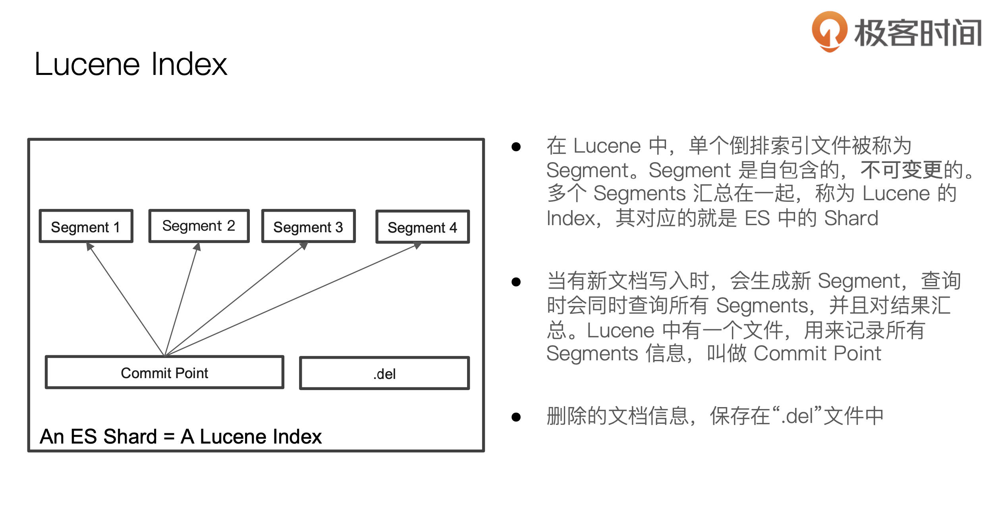
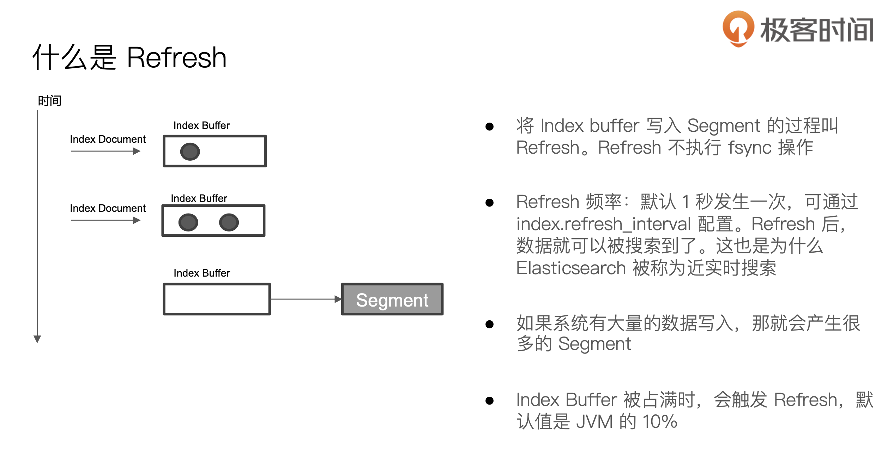
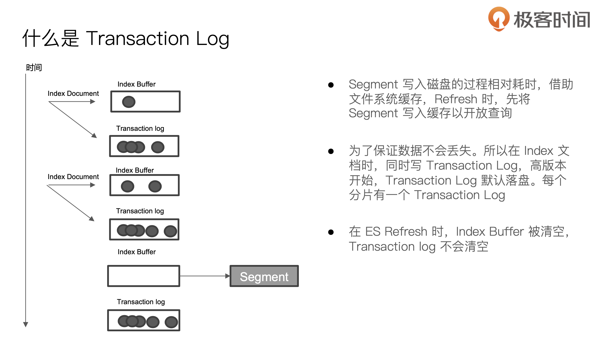
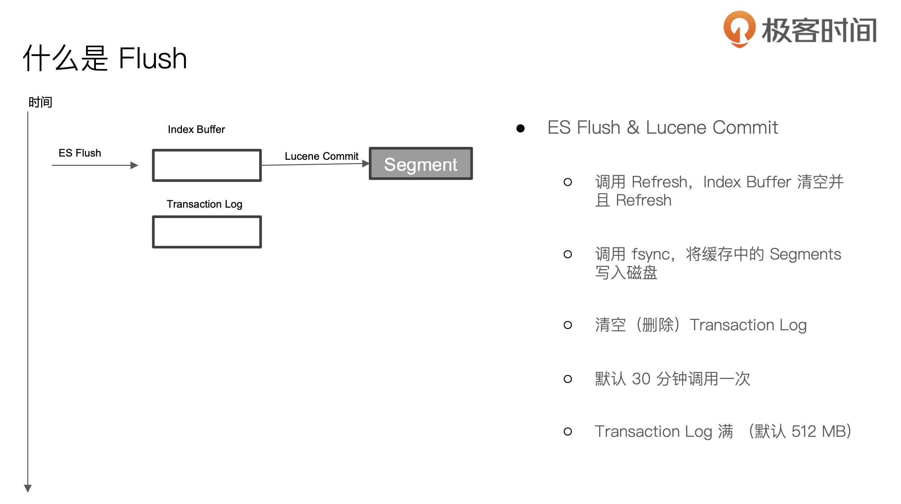

[toc]

问题

- version字段作用？es乐观锁并发控制
- Uri search 总结？
- Profile api 使用
- 分词器
- suggester api
- 跨集群搜索


----

## 索引

### 常用操作

```
// 创建索引
PUT /test
{
  "settings": {
    "number_of_shards": 1
  },
  "mappings": {
    "properties": {
      "field1": { "type": "text" }
    }
  }
}

// 删除 users 索引，不存在则报错
DELETE users

// 创建别名
POST _aliases
{
  "actions": [
    {
      "add": {
        "index": "my-data-stream",
        "alias": "my-alias",
        "filter": { // 可选，通过别名查询时会根据这个条件过滤
          "match": {
            "productID": "KDKE-B-9947-#kL5"
          }
        }
      }
    }
  ]
}

// 查看索引的别名
GET my-data-stream/_alias

// 删除别名
POST /_aliases
{
  "actions": [
    {
      "remove": {
        "index": "my-data-stream",
        "alias": "my-alias"
      }
    }
  ]
}
```

### Setting

```
// 查看索引设置，也返回默认设置
GET /my-index-000001/_settings?include_defaults=true

// 也可以通过通配符来查找
GET /log_2099_-*/_settings/index.number_*

// 更新 dynamic setting，不是所有设置都能更新
PUT /my-index-000001/_settings
{
  "index" : {
    "refresh_interval" : null // null表示设置为默认值
  }
}
```

### Reindex

将一个索引的数据拷贝到另一个索引，使用场景

- 修改字段类型
- 修改主分片数
- 数据迁移

```
POST _reindex
{
  "source": {
    "index": "my-index-000001"
  },
  "dest": {
    "index": "my-new-index-000001"
  }
}
```

## 文档

### 创建

```
// 自动生成id
POST users/_doc
{
  "user" : "sam"
}

// 指定id，已存在则报错
POST users/_create/1
{
  "user": "sam"
}

// 先删除，再写入
PUT users/_doc/1
{
  "user": "sam"
}

```

### 删除

```
// 根据id删除
DELETE users/_doc/1

// 根据特定条件删除
POST /users/_delete_by_query
{
  "query": {
    "match": {
      "user.id": "elkbee"
    }
  }
}
```

### 更新

```
// 如果字段不存在则新增字段
POST users/_update/1
{
  "doc": {
    "user": "sam"
  },
  "doc_as_upsert": true // 是否使用 upsert 方式，默认为false
}

// 通过 _seq_no 和 _primary_term 来控制并发更新
POST users/_update/1?if_seq_no=3&if_primary_term=1
{
  "doc": {
    "user": "sam"
  }
}
```

### 查询

```
// 根据id查询
GET movies/_doc/1

// uri query
GET movies/_search?from=40&size=20&sort=year:asc&q=year:1965

```

### 批量

```
POST _bulk // 可以使用 POST /<target>/_bulk 来指定索引
{ "index" : { "_index" : "test", "_id" : "1" } }
{ "field1" : "value1" }
{ "delete" : { "_index" : "test", "_id" : "2" } }
{ "create" : { "_index" : "test", "_id" : "3" } }
{ "field1" : "value3" }
{ "update" : {"_id" : "1", "_index" : "test"} }
{ "doc" : {"field2" : "value2"} }

GET /movies/_mget
{
  "ids" : ["4587", "4589"]
}

GET /_mget
{
  "docs": [
    {
      "_index": "my-index-000001",
      "_id": "1"
    },
    {
      "_index": "my-index-000001",
      "_id": "2"
    }
  ]
}

POST kibana_sample_data_ecommerce/_msearch
{}
{"query" : {"match_all" : {}},"size":1}
{"index" : "kibana_sample_data_flights"}
{"query" : {"match_all" : {}},"size":2}
```

### Update by Query

新增一个子字段（在原来的字段上新增分词器）时，子字段不会被索引，需要 `update by query`，再查询

```
POST blogs/_update_by_query
{
 // 可以设置查询条件，限制更新范围
}
```

## 搜索

分两种上下文：

- query：How well does this document match this query clause? 会计算分数
- filter：Does this document match this query clause? 不计算分数

```
GET /_search
{
  "query": { 
    "bool": { 
      "must": [ // query 上下文
        { "match": { "title":   "Search"        }},
        { "match": { "content": "Elasticsearch" }}
      ],
      "filter": [ // filter 上下文
        { "term":  { "status": "published" }},
        { "range": { "publish_date": { "gte": "2015-01-01" }}}
      ]
    }
  }
}
```

### 综合示例

```
POST kibana_sample_data_ecommerce/_search
{
  "profile": true, // 查询分析，默认为 false
  "from": 10, // from 和 size 用来分页
  "size": 5, 
  "sort":[{"order_date":"desc"}], // 排序
    "_source": ["order_date"],   // 只返回特定字段
  "query":{
    "match_all": {}
  }
}

// 查询全部数据，所有文档算分都一样
GET products/_search
{
  "query": {
    "match_all": {}
  }
}

// 返回空文档
GET /_search
{
  "query": {
    "match_none": {}
  }
}

// 计算符合条件的总数
GET /my-index-000001/_count
{
  "query" : {
    "term" : { "user.id" : "kimchy" }
  }
}
```

### Term-level queries

⚠️ 对输入不做分词

#### Exists

判断字段是否存在，为 null 或 [] 也被认为不存在

```
GET /_search
{
    "query": {
      "exists": {
        "field": "字段名"
      }
    }
}
```

#### Fuzzy

模糊查询，可以设置编辑距离

```
GET /_search
{
  "query": {
    "fuzzy": {
      "user.id": { // 字段名
        "value": "ki" 
      }
    }
  }
}
```

#### IDs

根据 id 查询

```
GET /_search
{
  "query": {
    "ids" : {
      "values" : ["1", "4", "100"]
    }
  }
}
```

#### Prefix

根据前缀查询

```
GET /_search
{
  "query": {
    "prefix": {
      "user.id": {
        "value": "ki"
      }
    }
  }
}

// 简写
GET /_search
{
  "query": {
    "prefix" : { 
      "user.id" : "ki" 
    	}
  }
}
```

#### Range

范围查询

```
GET /_search
{
  "query": {
    "range": {
      "age": {
        "gte": 10,
        "lte": 20,
        "boost": 2.0
      }
    }
  }
}
```

参数：

- gt：大于
- gte：大于或等于
- lt：小于
- lte：小于或等于

#### Regexp

根据正则表达式来检索

#### Term

根据某个特定的值来查询，相当于“等于”的含义，不应该用于 text 类型

⚠️对于多值字段，term 查询的含义是包含。如果需要判断字段只有单个值，需要新增一个字段表示这个字段值的数量，用组合查询的方式

```
GET /_search
{
  "query": {
    "term": {
      "user.id": {
        "value": "kimchy",
        "boost": 1.0
      }
    }
  }
}

// 只有value参数
GET /_search
{
  "query": {
    "term": {
      "user.id": "kimchy"
    }
  }
}
```

#### Terms

批量的 term 查询，类似 sql 中的 in 条件

```
GET /_search
{
  "query": {
    "terms": {
      "user.id": [ "kimchy", "elkbee" ],
      "boost": 1.0
    }
  }
}

// 关联查询，类似sql中使用join一张表，条件是in
GET my-index-000001/_search?pretty
{
  "query": {
    "terms": {
        "color" : {
            "index" : "my-index-000001", // 索引
            "id" : "2", // 索引的id
            "path" : "color" // 字段路径
        }
    }
  }
}
```

#### Terms set

类似 terms 查询，可以动态设置匹配数量

#### Wildcard

通配符查询，有点像 Regexp 查询

### Full text quries

#### Intervals

This search would match a `my_text` value of `my favorite food is cold porridge` but not `when it's cold my favorite food is porridge`

```
POST _search
{
  "query": {
    "intervals" : {
      "my_text" : {
        "all_of" : {
          "ordered" : true,
          "intervals" : [
            {
              "match" : {
                "query" : "my favorite food",
                "max_gaps" : 0,
                "ordered" : true
              }
            },
            {
              "any_of" : {
                "intervals" : [
                  { "match" : { "query" : "hot water" } },
                  { "match" : { "query" : "cold porridge" } }
                ]
              }
            }
          ]
        }
      }
    }
  }
}
```

#### Match

简单的全文本搜索

```
GET /_search
{
  "query": {
    "match": {
      "message": { // 字段名
        "query": "matrix reloaded",
        "operator": "and", // 匹配的文档必须同时包含 matrix 和 reloaded。默认是or，及文档包含 matrix 或 reloaded
        "minimum_should_match": 1 // 如果 operator 是 or，这里可以控制至少需要匹配多少个词
      }
    }
  }
}
```

#### Match boolean prefix

所有的词语都会转换成term查询，最后一个词是前缀查询

```
GET /_search
{
  "query": {
    "match_bool_prefix" : {
      "message" : "quick brown f"
    }
  }
}

// 上面的搜索相当于
GET /_search
{
  "query": {
    "bool" : {
      "should": [
        { "term": { "message": "quick" }},
        { "term": { "message": "brown" }},
        { "prefix": { "message": "f"}}
      ]
    }
  }
}
```

#### Match phrase

搜索结果中需要包含整个查询语句，可以通过 `slop` 来控制查询灵活度

```
// 返回的文档包含 this is a test
GET /_search
{
  "query": {
    "match_phrase": {
      "message": "this is a test"
    }
  }
}
```

#### Match phrase prefix

类似 `Match boolean prefix`，只不过匹配的是短语

```
GET /_search
{
  "query": {
    "match_phrase_prefix": {
      "message": {
        "query": "quick brown f"
      }
    }
  }
}
```

#### Combined fields

相当于可以在多个字段同时使用 `Match` 查询

```
GET /_search
{
  "query": {
    "combined_fields" : {
      "query":      "database systems",
      "fields":     [ "title", "abstract", "body"], // 字段名
      "operator":   "and" // 默认是 or
    }
  }
}

// 可以为每个字段设置 boost
GET /_search
{
  "query": {
    "combined_fields" : {
      "query" : "distributed consensus",
      "fields" : [ "title^2", "body" ]  // 相当于 title 字段出现的词都会匹配两次
    }
  }
}
```

#### Multi-match

可以在多个字段同时使用 `Match` 查询，跟 `Combined fields` 查询的区别：

- `Combined fields` 要求字段都是 `text` 类型的，并且使用相同的分词器；`Multi-match` 没有这个限制
- `Multi-match` 的功能更加丰富

```
GET /_search
{
  "query": {
    "multi_match" : {
      "query":    "this is a test", 
      "fields": [ "subject", "message" ],
    }
  }
}
```

`type` 取值：

##### best_fields

默认值，计算分数时取分数最高的字段。但是如果指定了 `tie_breaker`，那么计算分数时会加上其它字段的分数

```
GET /_search
{
  "query": {
    "multi_match" : {
      "query":      "brown fox",
      "type":       "best_fields",
      "fields":     [ "subject", "message" ],
      "tie_breaker": 0.3
    }
  }
}

// 相当于：
GET /_search
{
  "query": {
    "dis_max": {
      "queries": [
        { "match": { "subject": "brown fox" }},
        { "match": { "message": "brown fox" }}
      ],
      "tie_breaker": 0.3
    }
  }
} 
```

##### most_fields

计算分数时会把所有字段的分数相加，再除以字段数量，相当于取平均值

```
GET /_search
{
  "query": {
    "multi_match" : {
      "query":      "quick brown fox",
      "type":       "most_fields",
      "fields":     [ "title", "title.original", "title.shingles" ]
    }
  }
}

// 相当于
GET /_search
{
  "query": {
    "bool": {
      "should": [
        { "match": { "title":          "quick brown fox" }},
        { "match": { "title.original": "quick brown fox" }},
        { "match": { "title.shingles": "quick brown fox" }}
      ]
    }
  }
}
```

##### phrase, phrase_prefix

匹配短语，类似 `best_fields`

```
GET /_search
{
  "query": {
    "multi_match" : {
      "query":      "quick brown f",
      "type":       "phrase_prefix",
      "fields":     [ "subject", "message" ]
    }
  }
}

// 相当于
GET /_search
{
  "query": {
    "dis_max": {
      "queries": [
        { "match_phrase_prefix": { "subject": "quick brown f" }},
        { "match_phrase_prefix": { "message": "quick brown f" }}
      ]
    }
  }
}
```

##### cross_fields

把多个字段合并成一个字段来处理

```
GET /_search
{
  "query": {
    "multi_match" : {
      "query":      "Will Smith",
      "type":       "cross_fields",
      "fields":     [ "first_name", "last_name" ],
      "operator":   "and"
    }
  }
}

// 相当于
+(first_name:will last_name:will)
+(first_name:smith last_name:smith)
```

##### bool_prefix

类似 `Match boolean prefix`

#### Query string

一种全文检索的 dsl，⚠️不能用于子文档

```
// 例子
GET /_search
{
  "query": {
    "query_string": {
      "query": "(new york city) OR (big apple)", // dsl
      "default_field": "content", // 指定字段，也可以通过 fields 参数来指定
    }
  }
}

// status 字段包含 active
status:active

// author 字段包含短语 "john smith"
author:"John Smith"

// title 字段包含 quick 或 brown
title:(quick OR brown)

// 提高匹配 quick 的分数。boost 默认是1，0～1表示减少相关性，大于1表示提高相关性，小于0表示贡献负分
quick^2 fox

// boost 用在短语上
"john smith"^2

// boost 可以用在分组（用括号括起来）上
(foo bar)^4

// 可以用 + - 号
// quick 和 brown 是可选的，fox 必须存在，news 必须不存在
quick brown +fox -news

// 可以使用与或非
((quick AND fox) OR (brown AND fox) OR fox) AND NOT news

// 一个使用分组的例子
status:(active OR pending) title:(full text search)^2
```

#### Simple query string

```
// 例子
GET /_search
{
  "query": {
    "simple_query_string" : {
        "query": "\"fried eggs\" +(eggplant | potato) -frittata",
        "fields": ["title^5", "body"],
        "default_operator": "and" // 默认是 or
    }
  }
}

// 操作符
+ 与
| 或
- 不包含某个token
" 括住 token 表示短语
* 放在词尾表示前缀匹配
() 括号内优先级高

// 包含 foo || 包含 bar || 不包含 baz
foo bar -baz

// (包含 foo || 包含 bar) && 不包含 baz
foo bar +-baz
```

### 组合查询

#### Boolean

````
POST _search
{
  "query": {
    "bool" : {
      "must" : { // 必须匹配，计算分数，如果有多个条件，是 AND 关系
        "term" : { "user.id" : "kimchy" }
      },
      "filter": { // 必须匹配，不计算分数
        "term" : { "tags" : "production" }
      },
      "must_not" : { // 相			当于是filter的反义词，必须不匹配，也不会计算分数
        "range" : {
          "age" : { "gte" : 10, "lte" : 20 }
        }
      },
      "should" : [ // 相当于是 OR，会计算分数。如果没有 must，则should至少要满足一项
        { "term" : { "tags" : "env1" } },
        { "term" : { "tags" : "deployed" } }
      ],
      "minimum_sho	uld_match" : 1, // 控制 should 条件的匹配程度
      "boost" : 1.0
    }
  }
}

// 嵌套，实现了 should not 逻辑
POST /products/_search
{
  "query": {
    "bool": {
      "should": [
        {
          "bool": {
            "must_not": {
              "term": {
                "avaliable": "false"
              }
            }
          }
        }
      ],
      "minimum_should_match": 1
    }
  }
}

// 不同嵌套层级算分不一样。 匹配 quick 和 匹配 dog 是相同的算分，匹配 brown 或 red 的算分比 quick 要低
POST /animals/_search
{
  "query": {
    "bool": {
      "should": [
        { "term": { "text": "quick" }},
        { "term": { "text": "dog"   }},
        {
          "bool":{
            "should":[
               { "term": { "text": "brown" }},
               { "term": { "text": "red" }},
            ]
          }
        }
      ]
    }
  }
}
````

#### Boosting

如果一个文档同时满足 positive 和 negative，那么分数 = positive 分数 * negative_boost

```
GET /_search
{
  "query": {
    "boosting": { // 三个参数都是必填的
      "positive": {
        "term": {
          "text": "apple"
        }
      },
      "negative": {
        "term": {
          "text": "pie tart fruit crumble tree"
        }
      },
      "negative_boost": 0.5
    }
  }
}
```

#### Constant score

```
GET /_search
{
  "query": {
    "constant_score": {
      "filter": {
        "term": { "user.id": "kimchy" }
      },
      "boost": 1.2 // 设置固定分数
    }
  }
}
```

#### Disjunction max

计算分数时取分数最高的条件。但是如果指定了 `tie_breaker`，那么计算分数时会加上其它条件的分数

```
GET /_search
{
  "query": {
    "dis_max": {
      "queries": [
        { "term": { "title": "Quick pets" } },
        { "term": { "body": "Quick pets" } }
      ],
      "tie_breaker": 0.7
    }
  }
}
```

#### Function score

默认算分不能满足需求时，可以自定义分数计算方式

```
// score = 原始算分 * votes 字段值
POST /blogs/_search
{
  "query": {
    "function_score": {
      "query": {
        "multi_match": {
          "query":    "popularity",
          "fields": [ "title", "content" ]
        }
      },
      "field_value_factor": {
        "field": "votes"
      }
    }
  }
}

// 随机排序。场景：给不同用户展示不同的广告顺序，但是每个用户展示的顺序是固定的
POST /blogs/_search
{
  "query": {
    "function_score": {
      "random_score": {
        "seed": 911119
      }
    }
  }
}
```

### 分页

#### 普通分页

```
// 不支持深度分页
GET /_search
{
  "from": 5,
  "size": 20,
  "query": {
    "match": {
      "user.id": "kimchy"
    }
  }
}
```

#### 深度分页

```
// 1、创建一个pit (point in time)，在指定时间内不会查到更新的数据
POST /users/_pit?keep_alive=10m

// 返回示例
{
  "id" : "z4S1AwEFdXNlcnMWUDRFN2p4QUxRUXVkRGkzdm9BakctdwAWRVNCbERLaG9UdkNSN2NPcXkzVG9oZwAAAAAAAAe-PhZyLUpMS2VIYVFkaS1xdU10WDhNRUZBAAEWUDRFN2p4QUxRUXVkRGkzdm9BakctdwAA"
}

// 2、第一次查询，注意不能指定索引
GET /_search
{
  "size": 1,
  "query": {
    "match_all": {}
  },
  "pit": {
    "id": "z4S1AwEFdXNlcnMWUDRFN2p4QUxRUXVkRGkzdm9BakctdwAWRVNCbERLaG9UdkNSN2NPcXkzVG9oZwAAAAAAAAe9thZyLUpMS2VIYVFkaS1xdU10WDhNRUZBAAEWUDRFN2p4QUxRUXVkRGkzdm9BakctdwAA",
    "keep_alive": "1m"
  },
  "sort": [ // 要保证顺序是确定的，最好带上id
    { "age": "desc" },
    { "_id": "desc" }
  ]
}

// 返回示例
{
  "pit_id" : "z4S1AwEFdXNlcnMWUDRFN2p4QUxRUXVkRGkzdm9BakctdwAWRVNCbERLaG9UdkNSN2NPcXkzVG9oZwAAAAAAAAe9thZyLUpMS2VIYVFkaS1xdU10WDhNRUZBAAEWUDRFN2p4QUxRUXVkRGkzdm9BakctdwAA",
  "hits" : {
    "total" : {
      "value" : 3,
      "relation" : "eq"
    },
    "max_score" : null,
    "hits" : [
      {
        "_index" : "users",
        "_type" : "_doc",
        "_id" : "3",
        "_score" : null,
        "_source" : {
          "age" : 30
        },
        "sort" : [ 30, "3", 2 ]
      }
    ]
  }
}


// 3、后面再查询时，需要带上上一次查询返回的 pit 和 sort
GET /_search
{
  "size": 1,
  "query": {
    "match_all": {}
  },
  "pit": {
    "id": "z4S1AwEFdXNlcnMWUDRFN2p4QUxRUXVkRGkzdm9BakctdwAWRVNCbERLaG9UdkNSN2NPcXkzVG9oZwAAAAAAAAe9thZyLUpMS2VIYVFkaS1xdU10WDhNRUZBAAEWUDRFN2p4QUxRUXVkRGkzdm9BakctdwAA",
    "keep_alive": "1m"
  },
  "search_after": [ 30, "3", 2 ],
  "sort": [ // 要保证顺序是确定的，最好带上id
    { "age": "desc" },
    { "_id": "desc" }
  ]
}
```

### Collapse

作用类似于 sql 中的 distinct。用 bucket 也能实现这个功能，不过 collapse 性能更好。缺点是不能获取 collapse 后的总数

```
GET my-index-000001/_search
{
  "query": {
    "match": {
      "message": "GET /search"
    }
  },
  "collapse": {
    "field": "user.id" // 相当于对 user.id 分桶，取分值最高的文档
  }
}

// 分桶后按照 most_recent 来排序，展示每个桶的前5条数据
GET /my-index-000001/_search
{
  "query": {
    "match": {
      "message": "GET /search"
    }
  },
  "collapse": {
    "field": "user.id",                       
    "inner_hits": {
      "name": "most_recent",                  
      "size": 5,                              
      "sort": [ { "@timestamp": "desc" } ]    
    },
    "max_concurrent_group_searches": 4        
  }
}
```

## 搜索模版

```
// 创建或更新模版，id为 "my-search-template"
PUT _scripts/my-search-template
{
  "script": {
    "lang": "mustache",
    "source": {
      "query": {
        "match": {
          "message": "{{query_string}}"
        }
      },
      "from": "{{from}}",
      "size": "{{size}}"
    }
  }
}

// 根据id查找模版
GET _scripts/my-search-template

// 删除模版
DELETE _scripts/my-search-template

// 变量设置默认值
{{my-var}}{{^my-var}}default value{{/my-var}}

// 变量传参为json格式
{{#toJson}}

  POST _render/template
{
  "source": "{ \"query\": { \"terms\": { \"tags\": {{#toJson}}tags{{/toJson}} }}}",
  "params": {
    "tags": [
      "prod",
      "es01"
    ]
  }
}

// 使用模版
GET my-index/_search/template
{
  "id": "my-search-template",
  "params": {
    "query_string": "hello world",
    "from": 0,
    "size": 10
  }
}
```

## 聚合

### Bucket

满足一些条件的文档集合，相当于是分组，类似 sql 中的 `group by`

支持子聚合

GET 和 POST 都可以

```
// 通过 job.keyword 字段的值来分组，相当于是 group by 'job.keyword'
GET employees/_search
{
  "size": 0,
  "aggs": {
    "job": {
      "terms": {
        "field": "job.keyword",
        "size": 10, // 返回前10个桶
        "order": [ // 排序
          {
            "_key": "asc"
          },
          {
            "_count": "asc"
          }
        ]
      }
    }
  }
}

// 嵌套聚合，找出不同工种中，最老的3个员工
GET employees/_search
{
  "size": 0,
  "aggs": {
    "job": {
      "terms": {
        "field": "job.keyword"
      },
      "aggs": {
        "old_employees": {
          "top_hits": { // 找出年纪最大的3个员工，属于metric
            "size": 3,
            "sort": [
              {
                "age": {
                  "order": "desc"
                }
              }
            ]
          }
        }
      }
    }
  }
}

// 按照区间来分桶
GET employees/_search
{
  "size": 0,
  "aggs": {
    "salary_range": {
      "range": {
        "field":"salary",
        "ranges":[
          {
            "to":10000
          },
          {
            "from":10000,
            "to":20000
          },
          {
            "key":">20000", // 可以指定key，避免自动生成
            "from":20000
          }
        ]
      }
    }
  }
}

// 先用query过滤数据，再分桶
GET employees/_search
{
  "size": 0,
  "query": {
    "range": {
      "age": {
        "gte": 20
      }
    }
  },
  "aggs": {
    "jobs": {
      "terms": {
        "field":"job.keyword"
      }
    }
  }
}

// older_person 使用filter来过滤数据，all_jobs 是用全部文档来分桶
GET employees/_search
{
  "size": 0,
  "aggs": {
    "older_person": {
      "filter": {
        "range": {
          "age": {
            "from": 35
          }
        }
      },
      "aggs": {
        "jobs": {
          "terms": {
            "field": "job.keyword"
          }
        }
      }
    },
    "all_jobs": {
      "terms": {
        "field": "job.keyword"
      }
    }
  }
}

// 聚合的范围是全部文档，同时还能用post_filter来查询（不会影响聚合范围）。
GET employees/_search
{
  "aggs": {
    "jobs": {
      "terms": {
        "field": "job.keyword"
      }
    }
  },
  "post_filter": {
    "match_all":{}
  }
}

// all 聚合使用 global，不会受query条件的影响，从全部文档进行聚合
POST employees/_search
{
  "size": 0,
  "query": {
    "range": {
      "age": {
        "gte": 30
      }
    }
  },
  "aggs": {
    "jobs": {
      "terms": {
        "field": "job.keyword"
      }
    },
    "all": {
      "global": {},
      "aggs": {
        "salary_avg": {
          "avg": {
            "field": "salary"
          }
        }
      }
    }
  }
}

# 根据数量和key来对桶进行排序
POST employees/_search
{
  "size": 0,
  "aggs": {
    "jobs": {
      "terms": {
        "field":"job.keyword",
        "order":[
          {"_count":"asc"},
          {"_key":"desc"}
        ]
      }
    }
  }
}

# 根据子聚合的字段来排序
POST employees/_search
{
  "size": 0,
  "aggs": {
    "jobs": {
      "terms": {
        "field": "job.keyword",
        "order": [
          {
            "avg_salary": "desc"
          }
        ]
      },
      "aggs": {
        "avg_salary": {
          "avg": {
            "field": "salary"
          }
        }
      }
    }
  }
}
```

如果经常使用terms来聚合，且文档更新频繁，那么可以设置 eager_global_ordinals 来优化聚合性能

```
PUT index
{
  "mappings": {
    "properties": {
      "foo": {
        "type": "keyword",
        "eager_global_ordinals": true
      }
    }
  }
}
```

聚合会有一定精度问题，可以通过提高 shard_size 来提高精度，默认值为 size * 1.5 + 10

```
GET my_flights/_search
{
  "size": 0,
  "aggs": {
    "weather": {
      "terms": {
        "field":"OriginWeather",
        "size":1,
          "shard_size":1,
          "show_term_doc_count_error":true
      }
    }
  }
}
```


### Metric

一些统计方法，例如计算总数、平均值、最大值

```
// 计算最小、最大、平均值
GET employees/_search
{
  "size": 0,  // 不返回任何文档，只返回聚合信息
  "aggs": {
    "min-salary": {
      "min": {
        "field": "salary"
      }
    },
    "max-salary": {
      "max": {
        "field": "salary"
      }
    },
    "avg-salary": {
      "avg": {
        "field": "salary"
      }
    }
  }
}

// count distinct 'job.keyword'
GET employees/_search
{
  "size": 0,
  "aggs": {
    "job": {
      "cardinality": {
        "field": "job.keyword"
      }
    }
  }
}
```

### Pipeline

把其它聚合的结果再做一次处理

```
// 平均工资最低的工作类型
POST employees/_search
{
  "size": 0,
  "aggs": {
    "jobs": {
      "terms": {
        "field": "job.keyword",
        "size": 10
      },
      "aggs": {
        "avg_salary": {
          "avg": {
            "field": "salary"
          }
        }
      }
    },
    "min_salary_by_job":{
      "min_bucket": {
        "buckets_path": "jobs>avg_salary"
      }
    }
  }
}

// 员工按照年龄来分桶，每个桶统计平均工资，再累加各个桶的平均工资
POST employees/_search
{
  "size": 0,
  "aggs": {
    "age": {
      "histogram": {
        "field": "age",
        "min_doc_count": 1,
        "interval": 1
      },
      "aggs": {
        "avg_salary": {
          "avg": {
            "field": "salary"
          }
        },
        "cumulative_salary":{
          "cumulative_sum": {
            "buckets_path": "avg_salary"
          }
        }
      }
    }
  }
}
```

## 分布式特性和搜索机制

### 节点

coordinating node: 所有节点都是协调节点。客户端请求协调节点，协调节点再分发请求到合适的节点，然后汇总结果返回客户端。

master node: 创建/删除索引，维护集群节点状态……

data node: 文档 CRUD 操作，分片的维护

### 分片

文档会保存在各个分片上，分片的机制使得可以弹性扩容，也可以减轻单个节点的压力。默认根据文档id来路由到不同分片上。主分片可以处理数据的读写，副本分片只支持读数据。

#### segment



#### refresh



#### Transaction Log



#### Flush



#### Merge

Segment 很多，需要被定期被合并（减少 Segments / 删除已经删除的⽂文档）

ES 和 Lucene 会⾃自动进⾏行行 Merge 操作 `POST my_index/_forcemerge`

### 搜索

#### Query then Fetch

1. 协调节点接收客户端请求，选择合适的分片发送查询请求
2. 单个分片查询 from + size 个文档，返回 id 和分数给协调节点
3. 协调节点接收到分片的响应，再进行排序，选出最终的 from + size 个文档的 id，通过 mget 方式再从对应分片获取文档信息

#### DFS Query then Fetch

DFS 全称是 Distributed Frequence Search

搜索的URL 中指定参数 `_search?search_type=dfs_query_then_fetch`

会搜集各个分片的词频和文档评率，进行全局的算分，性能耗费比较大，不建议使用

## Nested

如果某个字段是对象，为了准确查询，应该把类型设置成 nested

```
PUT /my-index-000001
{
  "mappings": {
    "properties": {
      "obj1": {
        "type": "nested"
      }
    }
  }
}
```

### 查询

```
GET /my-index-000001/_search
{
  "query": {
    "nested": {
      "path": "obj1",
      "query": {
        "bool": {
          "must": [
            { "match": { "obj1.name": "blue" } },
            { "range": { "obj1.count": { "gt": 5 } } }
          ]
        }
      },
      "score_mode": "avg"
    }
  }
}

// 多层 nested 查询
PUT /drivers
{
  "mappings": {
    "properties": {
      "driver": {
        "type": "nested",
        "properties": {
          "last_name": {
            "type": "text"
          },
          "vehicle": {
            "type": "nested",
            "properties": {
              "make": {
                "type": "text"
              },
              "model": {
                "type": "text"
              }
            }
          }
        }
      }
    }
  }
}

GET /drivers/_search
{
  "query": {
    "nested": {
      "path": "driver",
      "query": {
        "nested": {
          "path": "driver.vehicle",
          "query": {
            "bool": {
              "must": [
                { "match": { "driver.vehicle.make": "Powell Motors" } },
                { "match": { "driver.vehicle.model": "Canyonero" } }
              ]
            }
          }
        }
      }
    }
  }
}
```

### must not

```
PUT my-index
{
  "mappings": {
    "properties": {
      "comments": {
        "type": "nested"
      }
    }
  }
}

PUT my-index/_doc/1?refresh
{
  "comments": [
    {
      "author": "kimchy"
    }
  ]
}

PUT my-index/_doc/2?refresh
{
  "comments": [
    {
      "author": "kimchy"
    },
    {
      "author": "nik9000"
    }
  ]
}

PUT my-index/_doc/3?refresh
{
  "comments": [
    {
      "author": "nik9000"
    }
  ]
}

// 这个会查处 id 为 1 和 2 的文档
POST my-index/_search
{
  "query": {
    "nested": {
      "path": "comments",
      "query": {
        "bool": {
          "must_not": [
            {
              "term": {
                "comments.author": "nik9000"
              }
            }
          ]
        }
      }
    }
  }
}

// 只查出 id = 1 的文档
POST my-index/_search
{
  "query": {
    "bool": {
      "must_not": [
        {
          "nested": {
            "path": "comments",
            "query": {
              "term": {
                "comments.author": "nik9000"
              }
            }
          }
        }
      ]
    }
  }
}
```

## 父子文档

如果读多写少，则用 nested 类型比较合适；如果更新比较频繁，则使用父子文档

### 设置 mapping

```
PUT my_blogs
{
  "settings": {
    "number_of_shards": 2
  },
  "mappings": {
    "properties": {
      "blog_comments_relation": {
        "type": "join",
        "relations": {
          "blog": "comment" // 父文档是blog，子文档是comment
        }
      },
      "content": {
        "type": "text"
      },
      "title": {
        "type": "keyword"
      }
    }
  }
}
```

### 新增

对子文档的操作（根据id查询、新增、修改、删除）都要带上 routing

```
// 插入父文档
PUT my_blogs/_doc/blog1
{
  "title":"Learning Elasticsearch",
  "content":"learning ELK @ geektime",
  "blog_comments_relation":{
    "name":"blog"
  }
}

// 插入子文档，需要带上父文档的 id 和 routing
PUT my_blogs/_doc/comment1?routing=blog1
{
  "comment":"I am learning ELK",
  "username":"Jack",
  "blog_comments_relation":{
    "name":"comment",
    "parent":"blog1"
  }
}
```

### 查询

```
// 根据 parent id 查询子文档
POST my_blogs/_search
{
  "query": {
    "parent_id": {
      "type": "comment",
      "id": "blog2"
    }
  }
}

// 根据子文档查询父文档
POST my_blogs/_search
{
  "query": {
    "has_child": {
      "type": "comment",
      "query": {
        "match": {
          "username": "Jack"
        }
      }
    }
  }
}

// 根据父文档查询子文档
POST my_blogs/_search
{
  "query": {
    "has_parent": {
      "parent_type": "blog",
      "query": {
        "match": {
          "title": "Learning Hadoop"
        }
      }
    }
  }
}
```

## Ingest Pipeline

可以对输入的数据进行预处理，例如格式转换，设置字段默认值……