[TOC]

# 分布式事务

分布式事务是一个跨多个数据源，并且需要保证 ACID 特性的事务。其中数据源可以是数据库、消息队列、缓存、ES 等等。X/Open 定义的分布式事务模型：

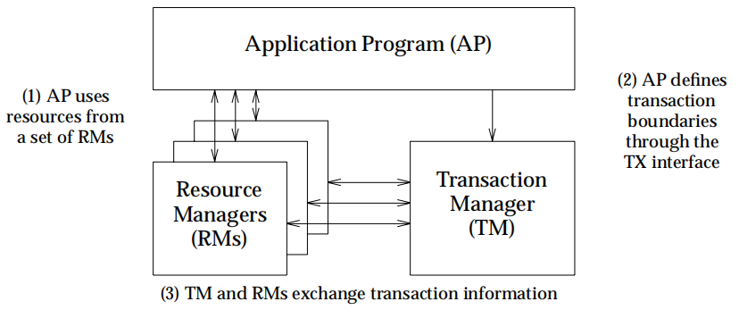

目前涉及到分布式事务的场景：

- 微服务架构下，保证多个服务的数据一致性
- 表因为数据量太大而分库，在单个应用中操作多个数据库

在微服务架构下，根据 CAP 定理，一致性、可用性和分区容忍性三者不可兼得。因为不能保证网络通信一定是可靠的，所以分区容忍性不能放弃。因此，分布式事务往往是在一致性和可用性之间做权衡。

为了方便说明各种分布式事务解决方案的原理，先举个购买商品的例子：购买商品时需要扣减库存和创建订单，但是这两步操作不是在同一个服务当中，我们需要保证扣减库存后，订单一定会创建，如下图所示：

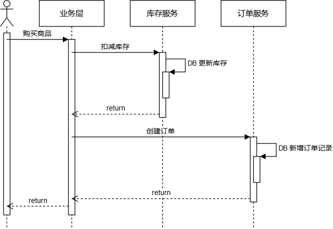

## 事务消息

为了保证一定能创建订单，最简单的方法就是重试。在扣减库存后，可以发一条消息给订单服务模块。目前消息队列基本都支持 “至少一次“ 的消息投递策略，可以保证消息最终一定会被正常消费。但是怎么保证库存扣减后，消息一定能发出去呢？可以新增一张消息表，在扣减库存后，插入一条消息记录。这两部操作需要在同一个事务里。同时会有一个后台线程，若检查到消息表有数据，则查出来并发送消息。当消息发送成功后，再删除对应的消息记录。整个流程如下图所示：

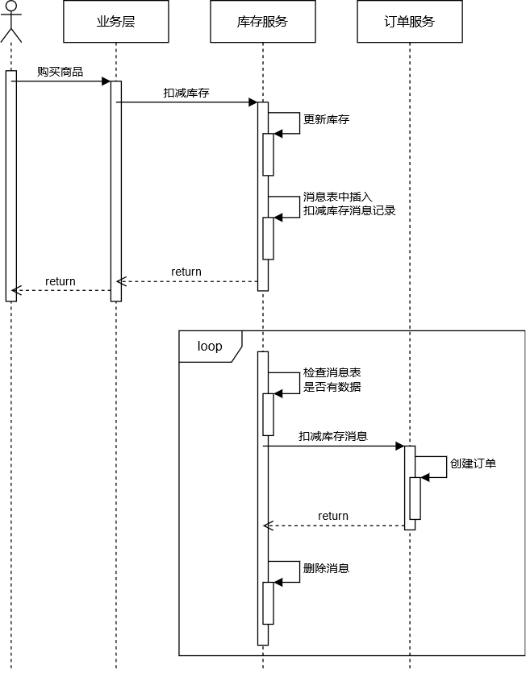

对于这种事务提交后，要求一定能发出去的消息，称之为 ”事务消息“。事务消息有两个比较大的缺点：

- 没有事务隔离性。扣减库存后，短时间内会查询不到订单，但是业务上已经是购买成功状态。
- 可能永远都无法成功消费消息。扣减库存后，如果需要扣减用户余额，但是余额不足，这种情况就不应该用事务消息。

## XA

在了解 XA 之前，先简单回顾下 2PC 的流程：

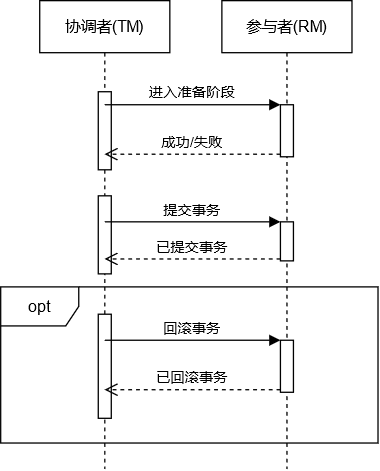

协调者先向所有参与者请求预备占用资源，进入准备阶段。如果所有参与者都准备成功，则再向所有参与者发起提交事务的请求，否则回滚事务。2PC 有几个要注意的点：

- 在进入准备阶段成功（失败）后，需要保证一定能成功提交（回滚）事务

- 在提交（回滚）事务时，可能因为网络中断导致提交（回滚）失败，所以往往会进行重试。因此需要保证二阶段的提交/回滚接口的幂等性

- 当 `PREPARE` 请求超时，协调者需要发出  `ROLLBACK` 请求。这时，参与者有可能先收到 `ROLLBACK` 再收到 `PREPARE`（不会出现先收到 `COMMIT`，再收到 `PREPARE`）。因此，参与者需要解决空回滚和资源悬挂问题

  - 空回滚：指 `ROLLBACK` 之前没有进行 `PREPARE`，这时应该回滚成功

  - 资源悬挂：指 `PREPARE` 预占用资源后，永远都不会进行 `COMMIT` 或 `ROLLBACK`，从而导致资源一直不被释放。这种情况一般只在 `PREPARE` 和 `ROLLBACK` 颠倒顺序时才会出现。因此参与者回滚时，需要记录事务的状态。当收到 `PREPARE`时，需要判断事务是否已经回滚。若是，则忽略该请求。

利用事务消息的解决方案，本质上就是重试，只满足最终一致性，跟事务所要求的 ACID 特性相差有点远。上世纪 90 年代，为了解决分布式事务的一致性问题，X/Open 组织提出一套基于 2PC 协议的规范 —— XA (eXtended Architecture).

XA 主要是定义了 TM 和 RM 之间的交互：

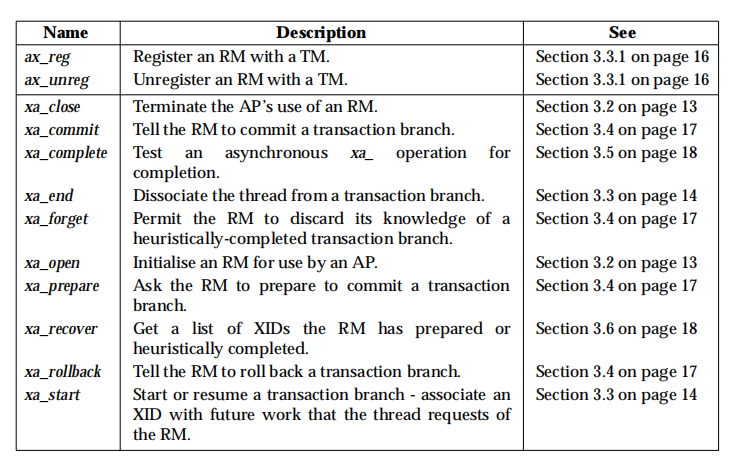

其中，ax 开头的操作，是由 RM 来 调用 TM；xa 开头的操作，是由 TM 来调用 RM。

目前，MySQL 通过提供以下 SQL 来支持 XA 事务：

```sql
/* 
 * 开启全局事务，xid 由 TM 生成，要保证全局唯一
 * 执行完该语句后，紧跟着执行业务 SQL. 
 */
XA {START|BEGIN} xid [JOIN|RESUME] 

/* 
 * 执行完业务 SQL 后，需要执行该语句表明已执行完成。
 */
XA END xid [SUSPEND [FOR MIGRATE]]

/* 
 * redo log 持久化事务，进入准备阶段。
 * 若在执行该语句之前宕机，则会自动回滚；若在执行该语句之后宕机，则需要通过 XA RECOVER 来查看 PREPARE 的事务，业务方自己决定回滚还是提交。
 */
XA PREPARE xid

/* 
 * 事务提交
 */
XA COMMIT xid [ONE PHASE]

/* 
 * 回滚事务
 */
XA ROLLBACK xid

/* 
 * 查看已经 PREPARE 的事务
 */
XA RECOVER [CONVERT XID]
```

用 XA 事务来解决用户购买商品的问题，交互流程如下：

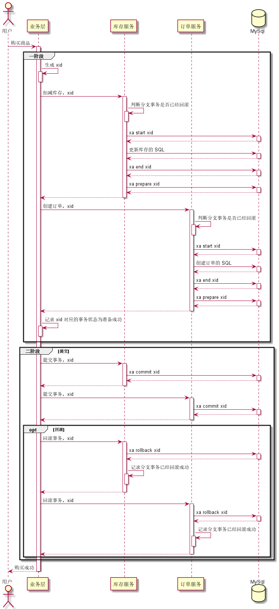

其中，业务层收到所有分支事务的 `PREPARE` 响应后，需要记录事务是提交还是回滚。当宕机重启时，通过 `XA RECOVER` 发现有未决的事务，则可以根据事务状态来决定提交还是回滚。

在不同业务场景下执行 XA 事务，只是执行的业务 SQL 不一样，流程是不需要变的。也就是说 XA 事务对业务透明，不需要改变业务流程。但其也有些缺点：

- 在单机事务中，数据库可以自动检测是否发生死锁，并选择回滚事务。但是在分布式事务中，MySQL 做不到。
- 若 MySQL 在执行 `XA PREPARE, XA COMMIT, XA ROLLBACK, XA COMMIT ... ONE PHASE` 时宕机，重启后不能保证 binlog 的一致性。
- 为了防止脏读，所有 SQL 必须要在串行化隔离级别执行，因此性能最差。
- 如果某个事务 PREPARE 后，一直没有 COMMIT 或 ROLLBACK，数据库不会自动释放锁，从而阻塞其它事务的执行，降低可用性（一致性和可用性不可兼得）。

## TCC 

TCC 是 Try-Confirm-Cancel 三个单词的缩写，分别对应 2PC 中的一阶段准备、二阶段提交和二阶段回滚。TCC 事务是一种业务层面的解决方案，需要把一个接口拆分成 3 个分别对应 Try、Confirm 和 Cancel 的接口。用 TCC 事务来解决用户购买商品的问题，流程如下：

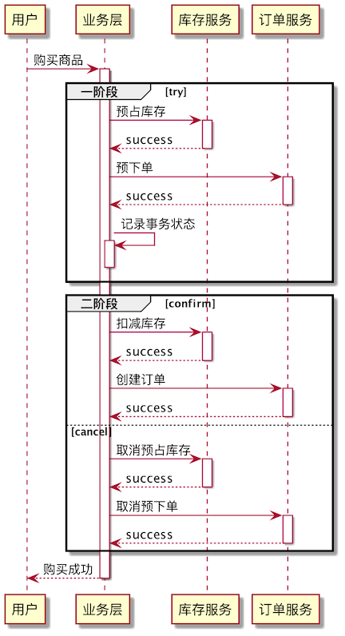

TCC 事务跟底层的数据存储机制没啥关系，所以要保证事务的隔离性，也得在业务层面解决。按照上面的流程，如果事务 T1 预占用库存时，直接把数据库的库存字段减一，那么其它事务获取库存时（在 T1 提交之前），就会读到了事务 T1 未提交的数据，即发生脏读。所以不能直接把库存数量减一，而是要新增一个字段表示预占用的库存，在预占库存时 `库存` 不变，`预占用的库存 + 1`，同时要保证 `库存 - 预占用的库存 >= 0`。在 Confirm 阶段时，再把 `库存` 和 `预占用的库存` 两个字段减一。

因为在分布式系统中，消息传递可能会发生重复或乱序，

在 XA 事务中，如果 XA 相关的 SQL 重复或乱序执行，数据库会提示错误。但在 TCC 事务中，我们得自己处理重复和乱序执行的场景。

为了使用 TCC 事务，需要把原有的业务逻辑改造，对业务有比较大的侵入性。但是 TCC 事务不像 XA 事务那样会一直给数据加锁，所以 TCC 事务的性能比 XA 事务高很多。

## SAGA 


定义、原理、怎么用、例子、优缺点

## Seata 框架

### XA 模式


由上面的交互时序图可以看出，使用 XA 事务时，应用程序担任了协调者的角色，2PC 和业务逻辑混合在一起，不方便使用。阿里开源的分布式事务框架 Seata (Simple Extensible Autonomous Transaction Architecture)，把协调者地角色抽离出来，使得可以像使用本地事务那样使用 XA 事务。

#### 使用示例

```java
/**
 * 替换数据源
 **/
@Bean("dataSourceProxy")
public DataSource dataSource(DruidDataSource druidDataSource) {
	return new DataSourceProxyXA(druidDataSource);
}
```

```java
/**
 * 替换事务注解
 **/
@GlobalTransactional(timeoutMills = 1000)
public void purchase(String userId, String commodityCode, int orderCount, boolean rollback) {
    String xid = RootContext.getXID();
    LOGGER.info("New Transaction Begins: " + xid);

    String result = storageFeignClient.deduct(commodityCode, orderCount);

    if (!SUCCESS.equals(result)) {
        throw new RuntimeException("库存服务调用失败,事务回滚!");
    }

    result = orderFeignClient.create(userId, commodityCode, orderCount);

    if (!SUCCESS.equals(result)) {
        throw new RuntimeException("订单服务调用失败,事务回滚!");
    }

    if (rollback) {
        throw new RuntimeException("Force rollback ... ");
    }
}
```

#### 整体机制

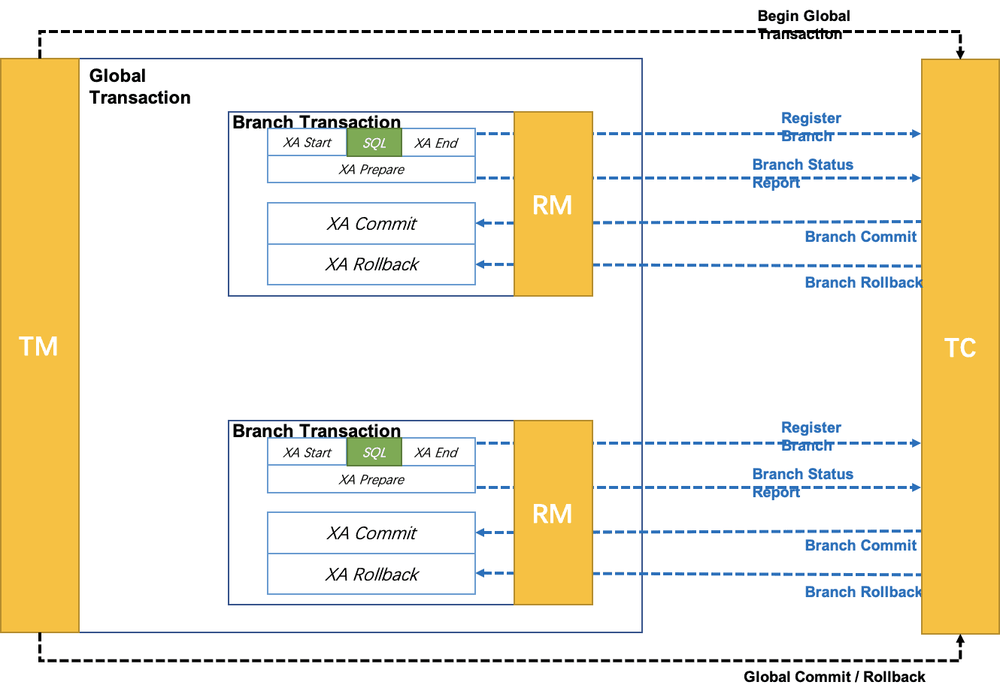

TM：定义全局事务的范围——开始全局事务、提交或回滚全局事务。

TC：全称 Transaction Coordinator，是 Seata 服务端（应用依赖的 Seata SDK 是客户端），维护全局和分支事务的状态，驱动全局事务提交或回滚。

RM：与TC交谈以注册分支事务和报告分支事务的状态，并驱动分支事务提交或回滚。

## AT 

为了解决 XA 事务下数据库长时间持有锁的问题，Seata 提供了 AT (Automatic Transaction) 模式。在此模式下，事务不依赖数据库的锁来保证串行化，而是使用 Seata 自己可控的全局锁。同时，Seata 也得负责数据的回滚操作。

### 使用示例

```java
/**
 * 替换数据源
 **/
@Bean("dataSourceProxy")
public DataSource dataSource(DruidDataSource druidDataSource) {
	return new DataSourceProxy(druidDataSource);
}
```

```java
/**
 * 替换事务注解，跟 XA 模式一样
 **/
@GlobalTransactional(timeoutMills = 1000)
public void purchase(String userId, String commodityCode, int orderCount, boolean rollback) {
    ......
}
```

### 实现原理

整体流程也是基于 2PC 协议，跟 XA 模式不同的是提交分支事务、回滚分支事务和提交全局事务这三个操作。

#### 提交分支事务

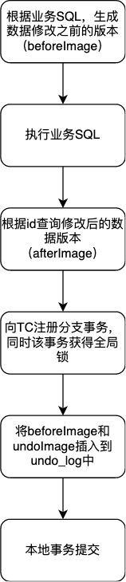

全局锁：锁住某个表中被修改的数据，根据表名、唯一键等字段生成

#### 提交全局事务

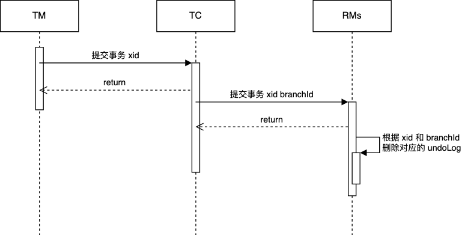

#### 回滚分支事务

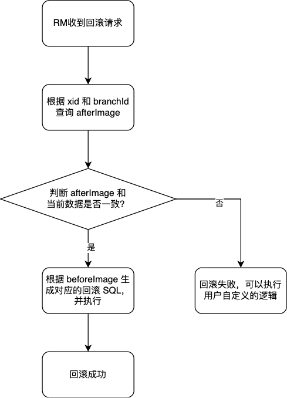

#### 隔离性

读数据：默认是读未提交。如果要读已提交，则需要使用 `select ... for update` 语句。Seata 检测到该语句，会自动请求全局锁。

写数据：如果两个事务都是分布式事务，则本身就已经通过全局锁来串行化执行；如果一个是分布式事务，另一个是单机事务，则单机事务需要通过手动加全局锁，防止分布式事务回滚异常。

#### 与 XA 事务相比

## 参考文献


