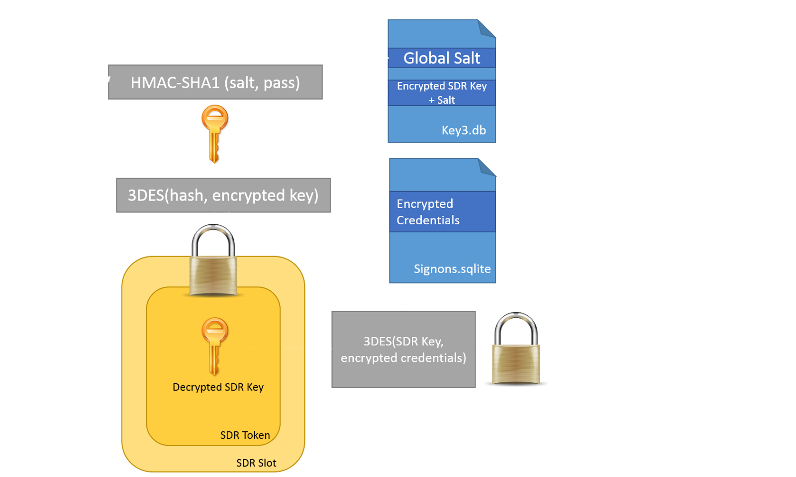
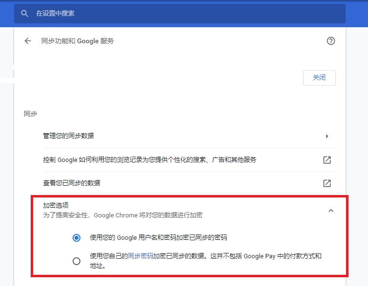

- [前言](#前言)
- [Chrome 的密码保存策略](#chrome-的密码保存策略)
  - [Windows](#windows)
  - [macOS](#macos)
- [Firefox 的密码保存策略](#firefox-的密码保存策略)
- [结论](#结论)
- [参考](#参考)
- [多说一句](#多说一句)

## 前言

一直都在用 Chrome，这周开始转到 Firefox。主要原因是 Chrome 的密码管理功能在 Windows 平台非常不安全，任何一个程序都可以在用户不知道的情况下，轻易地获取保存在浏览器中的账号和密码！

## Chrome 的密码保存策略

Chrome 的密码保存是依赖操作系统的，不同系统的采取方案会不一样。我只调研了 Windows 10 和 macOS 10.15 的。

### Windows

在 Windows 上，Chrome 会把网站的用户名和密码保存在 `%USERPROFILE%\AppData\Local\Google\Chrome\User Data\Default\Login Data` 文件中。这是一个 SQLite 数据库，其中表 logins 的字段 `password_value` 存的就是加密后的密码。

在 Chrome 80 版本之前，`password_value` 字段是通过 Windows 系统提供的 [CryptProtectData](https://docs.microsoft.com/en-us/windows/win32/api/dpapi/nf-dpapi-cryptprotectdata) 函数来加密。这个函数的作用是，用户登录操作系统后，应用程序可以用这个函数来加密数据。下次只要是同一个用户在同一台电脑登录，应用程序都可以用 [CryptUnprotectData](https://docs.microsoft.com/en-us/windows/win32/api/dpapi/nf-dpapi-cryptunprotectdata) 函数来解密。

在 Chrome 80 版本之后，加密方式有点变化。`password_value` 字段是通过 AES 加密，加密的密钥存放在 JSON 文件 `%USERPROFILE%\AppData\Local\Google\Chrome\User Data\Local State` 中的 `os_crypt.encrypted_key` 字段。看字段名可以知道是已经被加密过的，加密的方法还是使用 CryptProtectData 函数。

其实不管是哪种加密方式，都不安全。因为安全性完全是依赖操作系统的 API，而这些 API 鉴权是用户级别的，并不是应用级别。因此一些软件完全可以在运行时偷偷读取 Chrome 保存的密码，然后解密。整个解密过程是没有类似于输入密码等二次确认的方式，用户是不会知道自己的密码是否已经被泄露。

而且，这个密码保存策略是在浏览器内核 Chromium 中实现的。也就是说，其它依赖 Chromium 的浏览器，可能也会有这个问题。

### macOS

个人感觉 Chrome 的密码在 macOS 上安全很多。密码默认会保存在 SQLite 数据库 `~/Library/Application Support/Google/Chrome/Profile*/Login Data` 或 `~/Library/Application Support/Google/Chrome/Default/Login Data`。加密的密钥不像 Windows 上直接放在一个 JSON 文件中，而是放在 Keychain 里面，名称为 `Chrome Safe Storage`（当然这里保存的也不是最终用来加解密的密钥，还需要通过哈希等操作转换）。Keychain 是可以设置应用级别的访问控制，`Chrome Safe Storage` 默认是只允许 Chrome 访问。当其它没有权限的程序访问时，macOS 会弹出输入密码的窗口，让用户确定是否可以访问。

## Firefox 的密码保存策略

跟 Chrome 不一样的是，Firefox 在所有平台采用相同的密码保存策略，用户名和密码解密方式如下图所示（[图片来源](http://raidersec.blogspot.com/2013/06/how-browsers-store-your-passwords-and.html?m=1)）：

用户信息使用 3DES 加密，密钥叫做 SDR key (Secret Decoder Ring)。SDR key 又是由主密码和固定的盐经过哈希算法和加密变换而来。所以安全性在于主密码的保密性。Firefox 的主密码需要用户手动设置（各个平台都要设置，Firefox 不会同步主密码），如果不设置，默认会是一个空字符串 `""`，是很不安全的。如果设置之后忘了主密码，那么已经加密的数据是没办法解密的，只能重新设置主密码，并把老数据丢弃掉。

## 结论

经过比较 Chrome 和 Firefox 的密码保存策略，可以知道 Windows 上很容易泄露 Chrome 所保存的密码。Chrome 为什么不像 Firefox 那样采用主密码呢？我在网上找不到 Google 官方的解释，根据一些论坛的解释以及我自己的理解，大概有 3 点：
1. 没有绝对的安全。浏览器负责密码管理，那么密码总会以明文的方式存放到内存中，方便表单自动填充密码等操作。那么可以直接把浏览器进程的内存 dump 到文件中，从而获取真实的用户名和密码。也就是说，密码管理功能本来就不能做到 100% 安全。真在意安全性，就得人脑记住密码，一切的密码管理软件都是虚的。
2. 便利性和安全性的权衡。在 Firefox 设置了主密码，那么 Firefox 每次读取硬盘上保存的用户名和密码时，都要要求用户输入主密码，为了安全性就得降低用户体验。
3. 跟操作系统有关。macOS 的 Keychain 是个好东西，能做到应用级别的鉴权，既方便又能保证安全性。而Windows 系统还没有提供类似的鉴权机制。

## 参考

1. [这篇详细比较且剖析 Chrome、IE 和 Firefox 的密码存储策略，虽然文章比较老，但是也很有参考价值。](http://raidersec.blogspot.com/2013/06/how-browsers-store-your-passwords-and.html?m=1)
2. [这个脚本可以解密 Firefox 的密码，如果设置了主密码，也会在命令行提示用户输入。](https://github.com/unode/firefox_decrypt/blob/master/firefox_decrypt.py)
3. [这个 Python 脚本可以解密 macOS 的 Chrome 密码，而且脚本不依赖第三方库。](https://github.com/thanatoskira/OSXChromeDecrypt/blob/99320a386e970ffaa9a4351e31c4a3073ee88b51/ChromePasswords.py)
4. [StackOverflow 上有人给出了获取 Windows 的 Chrome 密码的 Python 脚本。](https://stackoverflow.com/questions/61099492/chrome-80-password-file-decryption-in-python)

## 多说一句

Chrome 的同步设置里有个加密选项。这里的加密不是指加密保存到硬盘上，而是指加密发送到 Google 的服务器，以便同步密码。为啥不用这样的策略来加密硬盘上的用户名和密码呢？可能是因为如果用户更改密码，处理起来会很麻烦吧。