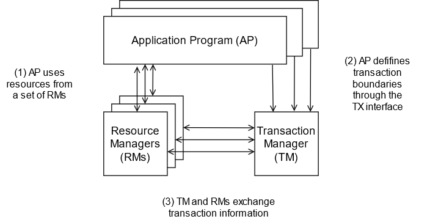
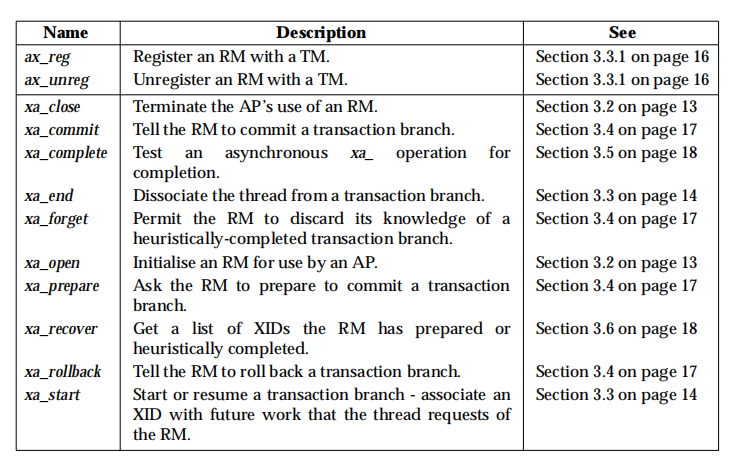
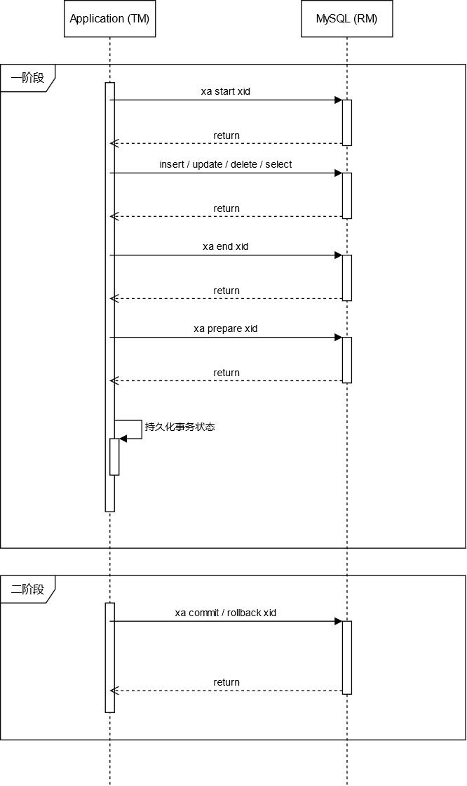

[TOC]

## 场景

- 微服务架构下，保证多个服务数据一致性

- 表因为数据量太大而分库，在单个应用中操作多个数据库

## 2PC

```
Coordinator                                          Participant
                             QUERY TO COMMIT
                 -------------------------------->
                             VOTE YES/NO             prepare*/abort*
                 <-------------------------------
commit*/abort*               COMMIT/ROLLBACK
                 -------------------------------->
                             ACKNOWLEDGMENT          commit*/abort*
                 <--------------------------------  
end
```

## 解决方案

### XA (eXtended Architecture)

XA 是 X/Open 组织定义的一套基于 2PC 协议的规范，目的是保证跨异构组件的事务的原子性。所谓的 “异构组件” 可以是数据库、消息队列、应用服务器、缓存等等。

其中，X/Open 还定义了分布式事务处理模型（Distributed Transaction Processing，简称 DTP 模型）：




XA 定义的规范：



#### MySQL 对 XA 的支持

```sql
XA {START|BEGIN} xid [JOIN|RESUME]

XA END xid [SUSPEND [FOR MIGRATE]]

XA PREPARE xid

XA COMMIT xid [ONE PHASE]

XA ROLLBACK xid

XA RECOVER [CONVERT XID]
```

交互过程：




```sql
mysql> XA START 'xatest';
Query OK, 0 rows affected (0.00 sec)

mysql> INSERT INTO mytable (i) VALUES(10);
Query OK, 1 row affected (0.04 sec)

mysql> XA END 'xatest';
Query OK, 0 rows affected (0.00 sec)

mysql> XA PREPARE 'xatest';
Query OK, 0 rows affected (0.00 sec)

mysql> XA COMMIT 'xatest';
Query OK, 0 rows affected (0.00 sec)
```

#### Seata 对 XA 的支持

##### 整体机制


TM：相当于上层聚合服务，通过调用各个外部服务来实现事务

RM：单个机器和数据库的连接，负责执行 SQL

TC：全称为 Transaction Coordinator，是 Seata 服务端（应用依赖的 Seata SDK 是客户端），决定事务是提交还是回滚

##### 用法

替换数据源：

```java
@Bean("dataSourceProxy")
public DataSource dataSource(DruidDataSource druidDataSource) {
	return new DataSourceProxyXA(druidDataSource);
}
```

声明式事务：

```java
@GlobalTransactional(timeoutMills = 1000000)
public void purchase(String userId, String commodityCode, int orderCount, boolean rollback) {
    String xid = RootContext.getXID();
    LOGGER.info("New Transaction Begins: " + xid);

    String result = storageFeignClient.deduct(commodityCode, orderCount);

    if (!SUCCESS.equals(result)) {
        throw new RuntimeException("库存服务调用失败,事务回滚!");
    }

    result = orderFeignClient.create(userId, commodityCode, orderCount);

    if (!SUCCESS.equals(result)) {
        throw new RuntimeException("订单服务调用失败,事务回滚!");
    }

    if (rollback) {
        throw new RuntimeException("Force rollback ... ");
    }
}
```

#### 优点

- 对业务透明，使用简单
- 一致性最高

#### 缺点

- 为了防止脏读，所有 SQL 必须要在串行化隔离级别执行，因此性能最差（可以考虑中间件层面搞个全局的 MVCC）
- 如果某个事务 `PREPARE` 后，迟迟没有 `COMMIT` 或 `ROLLBACK` 那么可能会一直阻塞其它事务读写
- 如果数据库在执行 `XA PREPARE, XA COMMIT, XA ROLLBACK, XA COMMIT ... ONE PHASE` 时宕机，重启后不能保证 binlog 的一致性

AT 
