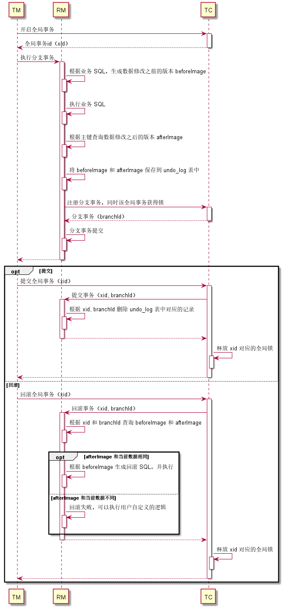

[TOC]

# 分布式事务

分布式事务是一个跨多个数据源，并且需要保证 ACID 特性的事务。其中数据源可以是数据库、消息队列、缓存、ES 等等。

目前涉及到分布式事务的场景：

- 微服务架构下，保证多个服务的数据一致性
- 表因为数据量太大而分库，在单个应用中操作多个数据库

在微服务架构下，根据 CAP 定理，一致性、可用性和分区容忍性三者不可兼得。因为不能保证网络通信一定是可靠的，所以分区容忍性不能放弃。因此，分布式事务往往是在一致性和可用性之间做权衡。

为了方便说明各种分布式事务解决方案的原理，先举个购买商品的例子：购买商品时需要扣减库存和创建订单，但是这两步操作不是在同一个服务当中，我们需要保证扣减库存后，订单一定会创建，如下图所示：


## 事务消息

为了保证一定能创建订单，最简单的方法就是重试。在扣减库存后，可以发一条消息给订单服务模块。目前消息队列基本都支持 “至少一次“ 的消息投递策略，可以保证消息最终一定会被正常消费。但是怎么保证库存扣减后，消息一定能发出去呢？可以新增一张消息表，在扣减库存后，插入一条消息记录。这两部操作需要在同一个事务里。同时会有一个后台线程，若检查到消息表有数据，则查出来并发送消息。当消息发送成功后，再删除对应的消息记录。整个流程如下图所示：


对于这种事务提交后，要求一定能发出去的消息，称之为 ”事务消息“。事务消息有两个比较大的缺点：

- 没有事务隔离性。扣减库存后，短时间内会查询不到订单，但是业务上已经是购买成功状态。
- 可能永远都无法成功消费消息。扣减库存后，如果需要扣减用户余额，但是余额不足，这种情况就不应该用事务消息。

## XA

### 2PC

在了解 XA 之前，先简单回顾下 2PC 的流程：


协调者先向所有参与者请求预备占用资源，进入准备阶段。如果所有参与者都准备成功，则再向所有参与者发起提交事务的请求，否则回滚事务。2PC 有几个要注意的点：

- 在进入准备阶段成功（失败）后，需要保证一定能成功提交（回滚）事务

- 在提交（回滚）事务时，可能因为网络中断导致提交（回滚）失败，所以往往会进行重试。因此需要保证二阶段的提交/回滚接口的幂等性

- 当`准备`请求超时，协调者需要发出 `回滚`请求。这时，参与者有可能先收到`回滚`请求再收到`准备`请求（不会出现先收到`提交`请求，再收到`准备`请求）。因此，参与者需要解决空回滚和资源悬挂问题

  - 空回滚：指`回滚`之前没有进入`准备`阶段，这时应该回滚成功
  - 资源悬挂：指`准备`阶段预占用资源后，永远都不会进行`提交`或`回滚`，从而导致资源一直不被释放。因此参与者回滚时，需要记录事务的状态。当收到`准备`请求时，需要判断事务是否已经回滚。若是，则忽略该请求。

### 概述

上世纪 90 年代，为了解决分布式事务的一致性问题，X/Open 组织提出一套基于 2PC 协议的规范 —— XA (eXtended Architecture)，同时也定义了分布式事务模型：


而 XA 规范则主要是定义了 TM 和 RM 之间的交互：


其中，ax 开头的操作，是由 RM 来 调用 TM；xa 开头的操作，是由 TM 来调用 RM。

目前，MySQL 通过提供以下 SQL 来支持 XA 事务：

```sql
/* 
 * 开启全局事务，xid 由 TM 生成，要保证全局唯一
 * 执行完该语句后，紧跟着执行业务 SQL. 
 */
XA {START|BEGIN} xid [JOIN|RESUME] 

/* 
 * 执行完业务 SQL 后，需要执行该语句表明已执行完成。
 */
XA END xid [SUSPEND [FOR MIGRATE]]

/* 
 * redo log 持久化事务，进入准备阶段。
 * 若在执行该语句之前宕机，则会自动回滚；若在执行该语句之后宕机，则需要通过 XA RECOVER 来查看 PREPARE 的事务，业务方自己决定回滚还是提交。
 */
XA PREPARE xid

/* 
 * 事务提交
 */
XA COMMIT xid [ONE PHASE]

/* 
 * 回滚事务
 */
XA ROLLBACK xid

/* 
 * 查看已经 PREPARE 的事务
 */
XA RECOVER [CONVERT XID]
```

用 XA 事务来解决用户购买商品的问题，交互流程如下：


由上面的交互时序图可以看出，使用 XA 事务时，应用程序担任了协调者的角色，2PC 和业务逻辑混合在一起，代码不好维护。实际上，不同业务场景，只是 `xa start xid` 和 `xa end xid` 之间执行的业务 SQL 不一样，其它步骤都是相同的，所以可以使用阿里开源的分布式事务框架 Seata (Simple Extensible Autonomous Transaction Architecture)。Seata 也解决了 XA 事务中空回滚和资源悬挂的问题。

### Seata 的 XA 模式

#### 代码示例

```java
/**
 * 替换数据源
 **/
@Bean("dataSourceProxy")
public DataSource dataSource(DruidDataSource druidDataSource) {
	return new DataSourceProxyXA(druidDataSource);
}
```

```java
/**
 * 替换事务注解
 **/
@GlobalTransactional(timeoutMills = 1000)
public void purchase(String userId, String commodityCode, int orderCount, boolean rollback) {
    String xid = RootContext.getXID();
    LOGGER.info("New Transaction Begins: " + xid);

    String result = storageFeignClient.deduct(commodityCode, orderCount);

    if (!SUCCESS.equals(result)) {
        throw new RuntimeException("库存服务调用失败,事务回滚!");
    }

    result = orderFeignClient.create(userId, commodityCode, orderCount);

    if (!SUCCESS.equals(result)) {
        throw new RuntimeException("订单服务调用失败,事务回滚!");
    }

    if (rollback) {
        throw new RuntimeException("Force rollback ... ");
    }
}
```

只需要替换数据源和事务注解，以及加一些配置文件就可以了，不需要进行业务改造。

#### 整体机制


TM：定义全局事务的范围——开始全局事务、提交或回滚全局事务。

TC：全称 Transaction Coordinator，是 Seata 服务端（应用依赖的 Seata SDK 是客户端），维护全局和分支事务的状态，驱动全局事务提交或回滚。

RM：与TC交谈以注册分支事务和报告分支事务的状态，并驱动分支事务提交或回滚。

XA 模式最大的好处是一致性高，且对业务透明，但是也有不少缺点：

- 在单机事务中，数据库可以自动检测是否发生死锁，并选择回滚事务。但是在分布式事务中，MySQL 做不到。
- 若 MySQL 在执行 `XA PREPARE, XA COMMIT, XA ROLLBACK, XA COMMIT ... ONE PHASE` 时宕机，重启后不能保证 binlog 的一致性。
- 为了防止脏读，所有 SQL 必须要在串行化隔离级别执行，因此性能最差。
- 如果某个事务 PREPARE 后，一直没有 COMMIT 或 ROLLBACK（例如极端情况下，Seata 服务挂了），数据库不会自动释放锁，从而阻塞其它事务的执行，降低可用性（一致性和可用性不可兼得）。

### Seata 的 AT 模式

XA 事务需要依赖数据库支持 XA 规范，由数据库来保证 ACID 特性。Seata 还提供了 AT (Automatic Transaction) 模式，在中间件层面来实现事务回滚、事务隔离等功能，也避免了数据库长时间持有锁的问题。

#### 代码示例

```java
/**
 * 替换数据源
 **/
@Bean("dataSourceProxy")
public DataSource dataSource(DruidDataSource druidDataSource) {
	return new DataSourceProxy(druidDataSource);
}
```

```java
/**
 * 替换事务注
 **/
@GlobalTransactional(timeoutMills = 1000)
public void purchase(String userId, String commodityCode, int orderCount, boolean rollback) {
    ......
}
```

代码修改跟 XA 模式相似，只是数据源不同。

#### 实现原理

##### 数据回滚

因为要在中间件层面支持回滚，所以需要事先在业务 SQL 操作的库中建一张 undo_log 表来记录数据修改之前的版本（beforeImage）和修改之后的版本（afterImage）。在执行分支事务时，Seata 会代理所有业务 SQL，如果业务 SQL 是 insert 语句，那么 beforeImage 就是空，afterImage 就是插入的数据；如果是 update 语句，例如 `update table set field = 'xxx' where id > 1`，则会先查出所有 `id > 1` 的数据，然后执行业务 SQL，再根据 beforeImage 中的数据唯一键，查询修改后的数据版本作为 afterImage。undo_log 表的数据需要跟业务 SQL 在同一个事务中提交。

当需要回滚事务时，会先查出当前的数据，判断跟 afterImage 是否相同。若相同，则将数据回滚成 beforeImage，否则回滚失败。

##### 隔离性

全局锁：每个分支事务在提交之前，会要求当前的全局事务获取全局锁。全局锁由表名、唯一键等字段生成，确保数据同时只会被一个全局事务修改。

读数据：默认是读未提交。如果要读已提交，则需要使用 `select ... for update` 语句。Seata 检测到该语句，会自动请求全局锁。

写数据：如果两个事务都是分布式事务，则本身就已经通过全局锁来串行化执行；如果一个是分布式事务，另一个是单机事务，则单机事务需要通过手动加全局锁，防止分布式事务回滚异常。

##### 整体流程



## TCC 

### 概述

TCC 是 Try-Confirm-Cancel 三个单词的缩写，分别对应 2PC 中的一阶段准备、二阶段提交和二阶段回滚。TCC 事务是一种业务层面的解决方案，需要把一个接口拆分成 3 个分别对应 Try、Confirm 和 Cancel 的接口。用 TCC 事务来解决用户购买商品的问题，大体流程如下：


TCC 事务跟底层的数据存储机制没啥关系，所以要保证事务的隔离性，得在业务层面解决。例如事务 T1 预占用库存时，如果直接把数据库的库存字段减一，那么其它事务在 T1 提交之前读取库存，就会读到了事务 T1 未提交的数据，即发生脏读。所以应该新增一个字段表示预占用的库存，在预占库存时 `库存` 不变，`预占用的库存 + 1`，同时要保证 `库存 - 预占用的库存 >= 0`。在 Confirm 阶段时，再把 `库存` 和 `预占用的库存` 两个字段减一。同理，订单也应该加一个状态字段。在 Try 阶段结束时，状态为 “预下单”，在 Confirm 阶段，再把状态改成正常订单的状态。

为了使用 TCC 事务，需要把原有的业务逻辑改造，对业务有比较大的侵入性。但是 TCC 事务不像 XA 事务那样会一直给数据加锁，所以 TCC 事务的性能比 XA 事务高很多。

### Seata 的 TCC 模式

#### 代码示例

```java
/**
 * The interface Tcc action one.
 *
 * @author zhangsen
 */
public interface TccActionOne {

    /**
     * Prepare boolean.
     *
     * @param actionContext the action context
     * @param a             the a
     * @return the boolean
     */
    @TwoPhaseBusinessAction(name = "DubboTccActionOne", commitMethod = "commit", rollbackMethod = "rollback")
    public boolean prepare(BusinessActionContext actionContext,
                           @BusinessActionContextParameter(paramName = "a") int a);

    /**
     * Commit boolean.
     *
     * @param actionContext the action context
     * @return the boolean
     */
    public boolean commit(BusinessActionContext actionContext);

    /**
     * Rollback boolean.
     *
     * @param actionContext the action context
     * @return the boolean
     */
    public boolean rollback(BusinessActionContext actionContext);
}

public interface TccActionTwo {

    /**
     * Prepare boolean.
     *
     * @param actionContext the action context
     * @param b             the b
     * @param list          the list
     * @return the boolean
     */
    @TwoPhaseBusinessAction(name = "DubboTccActionTwo", commitMethod = "commit", rollbackMethod = "rollback")
    public boolean prepare(BusinessActionContext actionContext,
                           @BusinessActionContextParameter(paramName = "b") String b,
                           @BusinessActionContextParameter(paramName = "c", index = 1) List list);

    /**
     * Commit boolean.
     *
     * @param actionContext the action context
     * @return the boolean
     */
    public boolean commit(BusinessActionContext actionContext);

    /**
     * Rollback boolean.
     *
     * @param actionContext the action context
     * @return the boolean
     */
    public boolean rollback(BusinessActionContext actionContext);

}
```

`TccActionOne` 和 `TccActionTwo` 分别是两个外部服务接口，代码里只需要调用 `prepare` 方法即可，框架会自动调用 `commit` 或 `rollback` 方法。

```java
@GlobalTransactional
public String doTransactionCommit() {
    //第一个TCC 事务参与者
    boolean result = tccActionOne.prepare(null, 1);
    if (!result) {
        throw new RuntimeException("TccActionOne failed.");
    }
    List list = new ArrayList();
    list.add("c1");
    list.add("c2");
    result = tccActionTwo.prepare(null, "two", list);
    if (!result) {
        throw new RuntimeException("TccActionTwo failed.");
    }
    return RootContext.getXID();
}
```

#### 实现原理

整体流程如下所示，跟 XA 或 AT 相比，相当于是提交和回滚时调用用户自定义的方法。


## SAGA 

### 概述

SAGA 不是缩写，单词本身的含义是 “长篇小说” ，表示长时间事务。SAGA 把一个大事务 T 拆分成多个小事务 T1, T2, T3 ... Tn，而且每个子事务 Ti 都要有对应的反向操作 Ci，Ti 和 Ci 要满足以下规则：

- Ti 和 Ci 要具有原子性和幂等性
- Ti 和 Ci 满足交换律，不管先执行 Ti，还是先执行 Ci，结果都是一样的
- Ci 必须能成功执行
- 要支持空回滚和防悬挂

事务 T 在执行时，如果执行到 Ti 失败，这时可以一直重试，直至成功，执行序列为 T1，T2，T3，…… ，Ti(失败)，Ti (重试)，……，Tn；也可以执行 Ti 的反向操作 Ci，执行序列为 T1，T2，T3，…… ，Ti(失败)，Ci，……，C3，C2，C1。

SAGA 事务跟 TCC 事务相比，SAGA 相当于少了第一步 Try 操作。在一些业务场景里，例如用户付款时，银行可能不会提供 Try 阶段的转账接口，这时便没法实现 TCC 事务。但是一般可以通过把钱转回给用户，来实现一个反向操作，所以可以考虑用 SAGA 事务。

用 SAGA 来解决一开始用户购买商品的问题，流程如下：


### Seata 的 SAGA 模式

SAGA 模式配置起来比较复杂，直接看[官方文档](http://seata.io/zh-cn/docs/user/saga.html)吧。

## 总结

分布式事务没办法做到像单机事务那样，高性能且满足 ACID 特性。往往需要根据具体的业务场景来选择不同的方案。如果不在意性能，可以使用 Seata 的 XA 或 AT 模式，二者对业务都没有侵入性，代码改造成本低。如果要求高性能，可以考虑事务消息或 TCC 的方式。如果调用外部接口，没办法实现 TCC 事务的三个阶段，则可以考虑使用 SAGA 事务。

## 参考文献

- [浅显易懂地讲了分布式事务的原理](http://icyfenix.cn/architect-perspective/general-architecture/transaction/distributed.html)
- [Seata 官方文档](http://seata.io/zh-cn/docs/overview/what-is-seata.html)
- [MySQL 中关于 XA 事务的说明](https://dev.mysql.com/doc/refman/8.0/en/xa.html)

