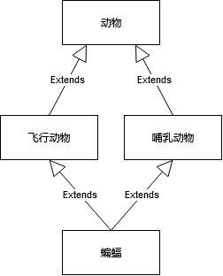

不管是《Effective Java》，还是四人帮的《设计模式》，都是推荐优先使用对象组合，慎用继承。因为继承会使得子类依赖父类实现的细节，如果父类实现细节改了（即使对外暴露的方法没变），那么子类的功能可能就会被破坏。也就是说，继承是一种比较紧耦合的复用代码方式。

其实除了这点外，用继承去建模，很容易会遇到多继承的场景。



如上图所示，`蝙蝠`有两个父类——`飞行动物`和`哺乳动物`，`飞行动物`和`哺乳动物`又都有一个共同的父类——`动物`。这样的继承关系也叫棱形继承。棱形继承会面临两个问题：

1. 祖先类初始化。创建一个 `蝙蝠` 对象时，需要初始化 `飞行动物` 和 `哺乳动物`，但是`飞行动物`和`哺乳动物`又都会各自初始化`动物`。也就是说，祖先类会被初始化两次。

2. 方法冲突。假如 `飞行动物` 和 `哺乳动物` 都各有一个 `eat` 方法，那么 `蝙蝠` 应该用哪一个呢？

这棱形继承的问题应该是没办法在语言层面自动解决的，不然为啥 Java、C# 等 OOP 语言会放弃多继承呢？

但是如果用组合去代替继承，有些时候是很不方便的。假设`飞行动物`有很多方法，`蝙蝠`也需要有，那么用组合的方式去写代码，就会像这样子：

```java
class Bat {
    FlyingAnimal flyingAnimal;
    Mammal mammal;

    void fly() {
        flyingAnimal.fly()
    }

    void eat() {
        flyingAnimal.eat()
    }
    
    void sing() {
        flyingAnimal.sing()
    }
    ...
}

```
这时 `Bat` 就像一个代理类，将方法调用转发到内部的 `FlyingAnimal`。如果用继承，那么就不需要写得这么繁琐。

其实还有一个简单的解决方法。Java8 的 interface 支持默认方法，而一个类是可以继承多个 interface 的。所以可以这么写：

```java
interface FlyingAnimal {
    
    /**
     * 因为接口里不能定义成员变量，然而方法实现里面又需要，
     * 所以只能通过getter来获取子类定义的成员变量
     */
    Wings getWings();
    
    default void fly() {
        Wings wings = getWings();
        // fly with wings
    }
    
    default void sing() {
        // singing
    }
    
    default void eat() {
        // eat
    }
}

interface Mammalian {

    default void lactate() {
        // 哺乳
    }
    
    default void eat() {
        // eat
    }
}

class Bat implements FlyingAnimal, Mammalian {
    
    Wings wings;

    Wings getWings() {
        return Wings;
    }
    
    /**
     * 这里必须重写，因为两个父类都有 eat 方法
     */
    @Override
    void eat() {
        FlyingAnimal.super.eat();
        Mammalian.super.eat();
    }
}

```
把`飞行动物`和`哺乳动物`的方法都放到 interface 的默认实现里面，这样子类只要实现这两个接口，自然也就拥有父类的方法。

这么写有点像是一个骚操作，因为 Java8 引入默认方法的初衷是想在已有的接口上加新的方法，而不用去改实现类。但是感觉这样子反而让 Java 拥有了类似 [mixin](https://en.wikipedia.org/wiki/Mixin) 的特性。接口不再仅仅表示类之间交互的协议，还表示一组功能（所以本文说”继承“接口，而不是”实现“接口。实现的是协议，继承的是功能）。一个类可以通过继承多个接口来获得新的能力，又不用担心棱形继承的问题。