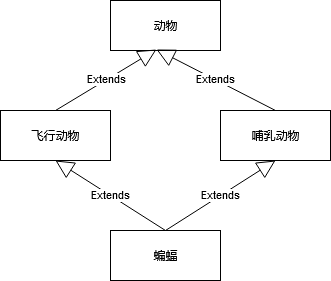

面向对象编程（Object Oriented Programming）的概念最初由 Alan Kay 在 1966 年左右提出。因为本科主修生物学，以及受到 Arpanet（互联网的前生）的启发，Alan Kay 认为软件应该由许多对象组成，每个对象就像生物细胞或互联网中的 PC 一样，对象之间只能通过消息来通信。对象可以是任何东西，一切皆对象。但对象并不是 OOP 的重点，消息传递才是。或许 OOP 改名叫 MOP（Message Oriented Programming）可能会更恰当点。

根据最原始的OOP概念，OOP 有3个特征：
1. 消息传递。
2. 封装。每个对象只知道自己的状态，以及有哪些处理消息的函数（方法），对象之间是隔离的，不同的对象甚至可以不在同一个进程里面。
3. 动态绑定。对象在运行期间才知道需要用哪些函数来处理消息。有点像现在常说的“多态”，在运行期间才知道调用哪个子类的方法。

后来 OOP的发展就渐渐背离了初衷，把继承当作面向对象设计的重点。因为继承是is-a关系，所以用继承去建模时，很容易会遇到类似下图棱形继承的场景。



棱形继承主要是有两个问题：
1. 祖先类初始化。例如创建一个 `蝙蝠` 对象时，需要初始化 `飞行动物` 和 `哺乳动物`。但是`动物`又应该又`飞行动物`还是`哺乳动物`来初始化呢，或者应该初始化两遍？ 
2. 方法冲突。假如 `飞行动物` 和 `哺乳动物` 都有一个 `eat` 方法，那么 `蝙蝠` 应该用哪一个呢？

现在貌似没有哪门编程语言能够很好的解决上述问题，在Java里面，类只能是单继承。除了棱形继承问题，继承还是一种紧耦合的代码复用方式。子类需要了解父类的细节，当父类发生改动时，所有的子类都可能需要改。因此在设计模式里面，推荐使用组合来代替继承，例如下面这样子。

```java
class 蝙蝠 {
    飞行动物 flyingAnimal
    哺乳动物 mammal

    蝙蝠() {
        flyingAnimal = new 飞行动物()
        mammal = new 哺乳动物()
    }

    void eat() {
        flyingAnimal.eat();
        mammal.eat();
    }
}
```

组合的方式相当于是手动解决了棱形继承的问题。虽然组合可以让程序更容易扩展，但是写代码的时候可能会很繁琐。假设飞行动物除了 eat 方法外，还有许多其它的方法，这些方法蝙蝠类也需要有，于是代码就得这么写：

```java
class 蝙蝠 {
    飞行动物 flyingAnimal
    哺乳动物 mammal

    ......

    void fly() {
        flyingAnimal.fly()
    }

    void otherFunc() {
        flyingAnimal.otherFunc()
    }
}

```
也就是说，使用组合，相当于是做了一层代理，每个方法可能都得代理一遍，这样子写代码也就太繁琐了，用继承反而可以减少工作量。

组合和继承就像两个极端，一些语言提供了折中的解决方法——mixin（混入）。java并没有天生支持mixin，但是java8的interface支持默认方法，interface又是可以多继承的，所以可以用interface来实现mixin。

```java
interface Flyable {
    
    Wings getWings();
    
    default void fly() {
        Wings wings = getWings();
        // fly with wings
    }
}

interface Mammalian {

    default void lactate() {
        // eat with mouth
    }
}

class Bat implements Flyable, Mammalian {
    
    Wings wings;

    Wings getWings() {
        return Wings;
    }
}

```
`eat`  和 `fly` 是很通用的能力，可以抽出来分别放到单独的interface。因为interface不能有成员变量，所以只能通过getter的方式来获取。`蝙蝠` 直接实现这两个get方法时，也就拥有fly和eat的方法了